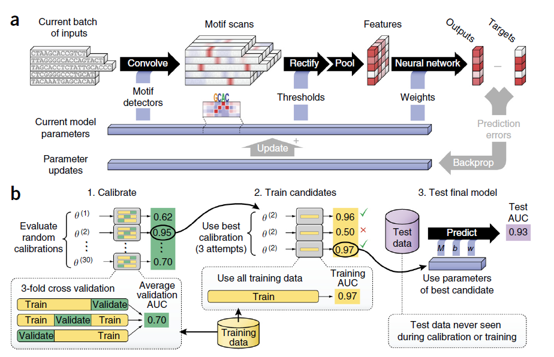
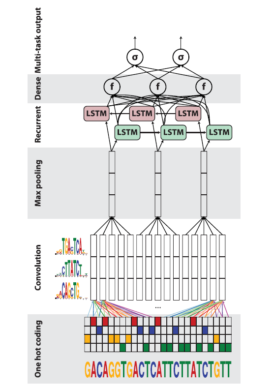

## 2018-05-30 DeepBind: Deep ConvNets

Alipanahi B, Delong A, Weirauch M T, et al. [Predicting the sequence specificities of DNA- and RNA-binding proteins by deep learning](https://www.nature.com/articles/nbt.3300 "Predicting the sequence specificities of DNA- and RNA-binding proteins by deep learning")[J]. Nature Biotechnology, 2015, 33(8):831.

### Introduction

**DeepBind**, is based on deep convolutional neural networks and can discover new patterns even when the locations of patterns within sequences are unknown

**challenging aspects** of modern high-throughput technologies:

- Data come in qualitatively different forms
- The quantity of data is large(10,000 and 100,000 sequences)
- Each data acquisition technology has its own artifacts, biases and limitations
#### Model Layers

1. **Input:**The sequence specificities of DNA- and RNA-binding proteins

2. **1 Convolution Layer** 
  Purpose: to scan sequences for motif detectors;

3. **1 Rectification Layer:** to isolate positions with a good pattern match by shifting the response of detector

4. **1 Pooling Layer:** computes the maximum and average of each motif detector’s rectified response across the sequence

#### Model Details

- Feed-forward(predictions): 
  - a) Convolution:convert sequence s to `(n=2m-2)*4` array S and output an `(n+m-1)*d` array X
  - b) They also tried to y is to initialize kernels from known motifs
- Validation loss(cross-entropy, classification) is evaluated at the end of each training epoch to monitor convergence 
- Dropout is implemented
- Logistic regression Model is trained for benchmark purposes
- **Training Time**: for 320 convolution, 60 epochs, while each takes ~6h.

#### Comments

- They use **Precision-Recall AUC**, because given the sparsity of positive binary targets (∼2%), the ROC AUC statistic is highly inflated by the class imbalance, while PR AUC is less prone to inflation by the class imbalance than ROC AUC. This is a fact overlooked in the original DeepSEA paper. 

- DanQ is often compared with DeepSEA, they share datasets, and there are comparison results in DanQ paper.

----------

## 2018-06-04 DanQ:	ConvNets+BLSTM
Quang D, Xie X. [DanQ: a hybrid convolutional and recurrent deep neural network for quantifying the function of DNA sequences](http://xueshu.baidu.com/s?wd=paperuri%3A%28ec1ae89d7460896b1bb7cce04ebd9bde%29&filter=sc_long_sign&tn=SE_xueshusource_2kduw22v&sc_vurl=http%3A%2F%2Feuropepmc.org%2Farticles%2FPMC4914104%2F&ie=utf-8&sc_us=8666273945498306028)[J]. Nucleic Acids Research, 2016, 44(11):e107-e107.
### Source code
[https://github.com/uci-cbcl/DanQ](https://github.com/uci-cbcl/DanQ)

### Introduction
- over 98% of the human genome is non-coding.
- Over 1200 GWAS have identified nearly 6500 disease- or trait-predisposing SNPs, 93% of which are located in non-coding regions.
- CNN and RNN, the variants of DNNs are appropriate for this task.

#### Model Layers
- **Input layer:** One-hot encoding
- **Convolution layer**: 1 convolution layer and 1
max pooling layer to scan sequences for motif
sites
- **BLSTM layer:** motifs can follow a regulatory grammar governed by physical constraints.
- **Dense layer:**rectified linear units
- **Output layer:** muti-task sigmoid

#### Model details
- **Initialization:**All weights are initialized by randomly from (-0.05, 0.05), and all biases are initially set to 0.
- **Optimization：****RMSprop** algorithm with a minibatch size of 100; **Cost function**: averagemulti-task binary cross entropy loss function
- **Implementation：**Keras 0.2.0 library with the Theano 0.7.1 (21,22) backend with NVIDIA Titan Z GPU.
- **Evaluation:**ROC AUC curve; Precision-Recall cureve(P-R curve); PR-AUC scatter.(*PR AUC is less prone to inflation by the class imbalance than ROC AUC*)

#### Results
- ROC AUC: DanQ outperforms DeepSEA for 94.1% of the targets.
- PR AUC： 97.6% of all DanQ PR AUC scores surpass DeepSEA PR AUC scores.

#### Future works
- the model can be made fully recurrent so it can process
sequences of arbitrary length, and also may explore the long-range consequences in linkage disequilibrium
- More data
- update and improve the DanQ model(kernels, weights initialization, hyperparameter tuning algorithms).
