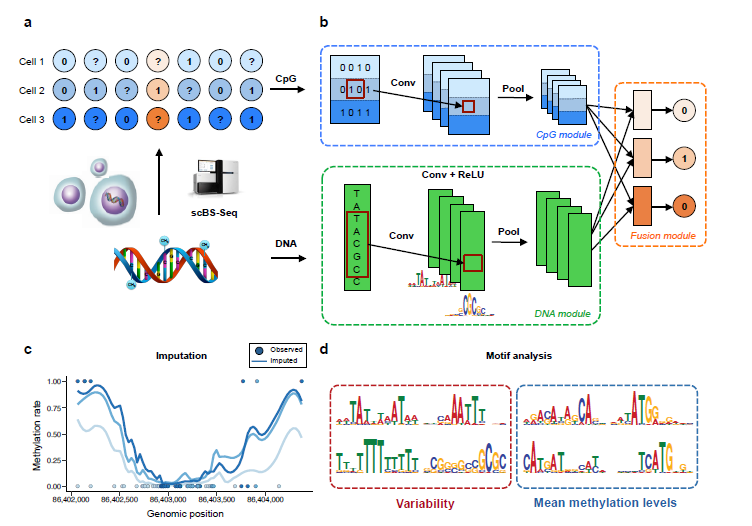

}}=\\sum_{i:r(i,j)=1}{\\big((\\theta^{(j)})^Tx^{(i)}-y^{(i,j)}\\big)x_k^{(i)}}+\\lambda \\xtheta_k^{(j)})

作者：Deep Reader
链接：https://www.zhihu.com/question/26887527/answer/43166739
来源：知乎
著作权归作者所有。商业转载请联系作者获得授权，非商业转载请注明出处。
## 2018-05-30 DeepBind: Deep ConvNets

Alipanahi B, Delong A, Weirauch M T, et al. [Predicting the sequence specificities of DNA- and RNA-binding proteins by deep learning](https://www.nature.com/articles/nbt.3300 "Predicting the sequence specificities of DNA- and RNA-binding proteins by deep learning")[J]. Nature Biotechnology, 2015, 33(8):831.

### Introduction

**DeepBind**, is based on deep convolutional neural networks and can discover new patterns even when the locations of patterns within sequences are unknown

**challenging aspects** of modern high-throughput technologies:

- Data come in qualitatively different forms
- The quantity of data is large(10,000 and 100,000 sequences)
- Each data acquisition technology has its own artifacts, biases and limitations
#### Model Layers

1. **Input:**The sequence specificities of DNA- and RNA-binding proteins

2. **1 Convolution Layer** 
  Purpose: to scan sequences for motif detectors;

3. **1 Rectification Layer:** to isolate positions with a good pattern match by shifting the response of detector

4. **1 Pooling Layer:** computes the maximum and average of each motif detector’s rectified response across the sequence

#### Model Details

- Feed-forward(predictions): 
  - a) Convolution:convert sequence s to `(n=2m-2)*4` array S and output an `(n+m-1)*d` array X
  - b) They also tried to y is to initialize kernels from known motifs

----------

## 2018-06-04 DanQ:	ConvNets+BLSTM
Quang D, Xie X. [DanQ: a hybrid convolutional and recurrent deep neural network for quantifying the function of DNA sequences](http://xueshu.baidu.com/s?wd=paperuri%3A%28ec1ae89d7460896b1bb7cce04ebd9bde%29&filter=sc_long_sign&tn=SE_xueshusource_2kduw22v&sc_vurl=http%3A%2F%2Feuropepmc.org%2Farticles%2FPMC4914104%2F&ie=utf-8&sc_us=8666273945498306028)[J]. Nucleic Acids Research, 2016, 44(11):e107-e107.
### Source code
[https://github.com/uci-cbcl/DanQ](https://github.com/uci-cbcl/DanQ)

### Introduction
- over 98% of the human genome is non-coding.
- Over 1200 GWAS have identified nearly 6500 disease- or trait-predisposing SNPs, 93% of which are located in non-coding regions.
- CNN and RNN, the variants of DNNs are appropriate for this task.

#### Model Layers
- **Input layer:** One-hot encoding
- **Convolution layer**: 1 convolution layer and 1
max pooling layer to scan sequences for motif
sites
- **BLSTM layer:** motifs can follow a regulatory grammar governed by physical constraints.
- **Dense layer:**rectified linear units
- **Output layer:** muti-task sigmoid

#### Model details
- **Initialization:** All weights are initialized by randomly from (-0.05, 0.05), and all biases are initially set to 0.
- **Optimization：** **RMSprop** algorithm with a minibatch size of 100; **Cost function**: averagemulti-task binary cross entropy loss function
- **Implementation：** Keras 0.2.0 library with the Theano 0.7.1 (21,22) backend with NVIDIA Titan Z GPU.
- **Evaluation:** ROC AUC curve; Precision-Recall cureve(P-R curve); PR-AUC scatter.(*PR AUC is less prone to inflation by the class imbalance than ROC AUC*)

#### Results
- ROC AUC: DanQ outperforms DeepSEA for 94.1% of the targets.
- PR AUC： 97.6% of all DanQ PR AUC scores surpass DeepSEA PR AUC scores.

#### Future works
- the model can be made fully recurrent so it can process
sequences of arbitrary length, and also may explore the long-range consequences in linkage disequilibrium
- More data
- update and improve the DanQ model(kernels, weights initialization, hyperparameter tuning algorithms).

---

## 2018-06-05 DeepCpG:
Angermueller C, Lee H J, Reik W, et al. [DeepCpG: accurate prediction of single-cell DNA methylation states using deep learning](https://link.springer.com/article/10.1186/s13059-017-1189-z)[J]. Genome Biology, 2017, 18(1):67.

### Source code
[https://github.com/cangermueller/deepcpg](https://github.com/cangermueller/deepcpg)

### Introduction
- DNA methylation is one of the most extensively studied epigenetic marks.
- Recent technological advances for DNA methylation: scBS-seq, scRRBS have uncovered new **linkages** between epigenetic and transcriptional heterogeneity.
- **Existing methods:** do not account for cell-to-cell variability; require a priori defined features and genome annotations.
- **DeepCpG:** predicting single-cell methylation states and for modelling
the sources of DNA methylation heterogeneity; does not
separate the extraction of DNA sequence features and model training

### Model layers
- **Sparse single-cell CpG profiles**
- **CpG module** Convolutional filters + Pooling: identifies patters in the CpG neighbourhood across multiple cells
- **DNA module** Convolutional filters + Pooling + ReLU : identify predictive sequence
motifs.
- **Fusion module** Learns cell-specific interactions between higher-level features from CpG module and DNA module.

### Model details
- **Convolution layer:** activation function `a` and pooling function `p` as follows

	 
 
- **Output layer:** activation function

	
- **cost funtion:** mini-batch:`SGD-Adam`, `learning_rate=0.5`,
	
	
### Experiments
1. **DeepCpG accurately predicts single-cell methylation states**
	- **Figuration:** `object`: 32 mouse embryonic stem cells(20 serum-cultured, 12 2i-cultured); `train_test`:holdout validation; `evaluation`：AUC, PR curve; 
	
2. **Analysis the effect of DNA sequence features on DNA methylation**
3. **Discovery of DNA sequence motifs that are associated with
epigenetic variability**

### Advantages
- Its convolutional architecture: allows for discovering predictive motifs in larger DNA sequence contexts, as well as for capturing complex methylation
patterns in neighbouring CpG sites.
- DeepCpG learns higherlevel annotations from the DNA sequence
